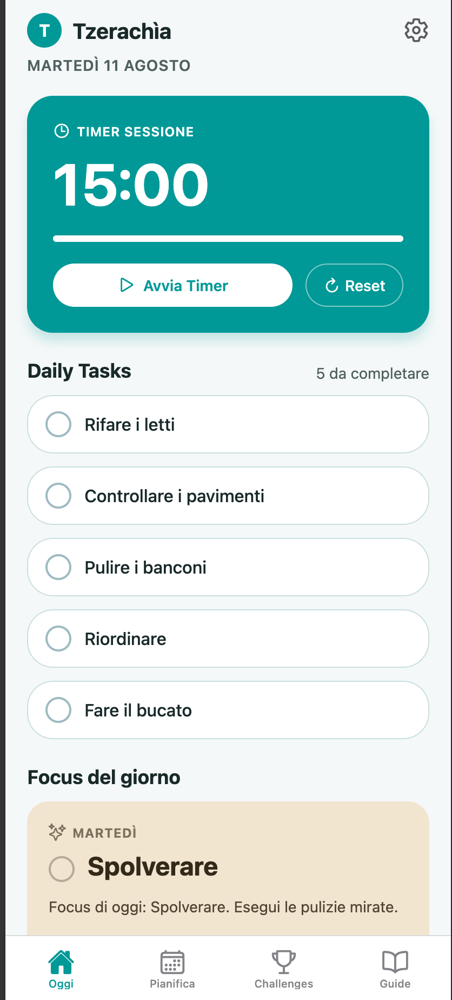
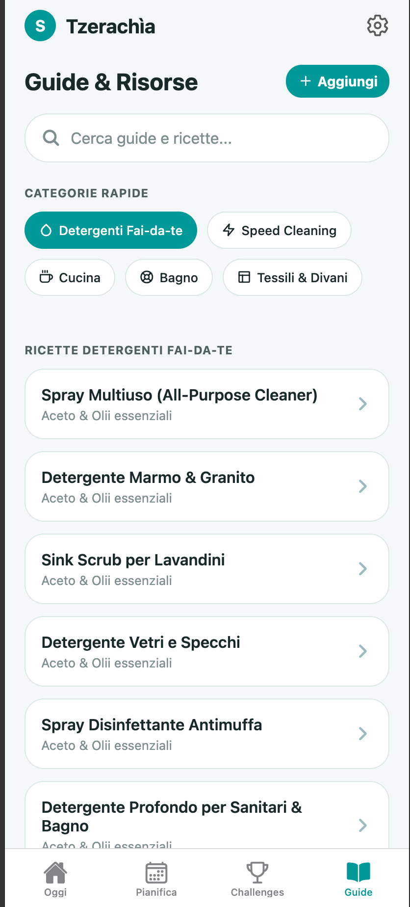
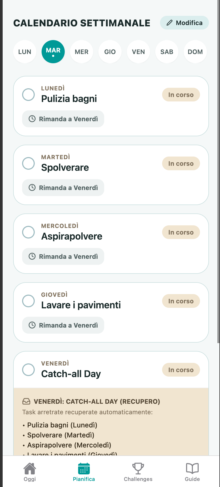

# Tzerachìa 🧹✨

Tzerachìa is a beautiful mobile application designed to simplify and organize daily and weekly household chores, as well as intensive cleaning challenges, inspired by the famous Clean Mama method. Built with React Native and Expo, it offers a modern, smooth, and minimalist user experience in iOS style.

## Key Features

- **Daily Routine (Daily Tasks)**: 5 essential daily micro-tasks to keep the house consistently tidy (make the beds, check the floors, etc.).
- **Daily Focus**: Each day is assigned a specific area of the house (e.g., Mondays for bathrooms, Tuesdays for dusting) so you never have to do all the "heavy cleaning" at once.
- **15-Minute Session Timer**: A built-in timer for your "Focus" to help you concentrate without stress, featuring haptic feedback (vibration) upon completion.
- **Challenges**: 7- or 28-day challenges to get your home back in shape from scratch, trackable step-by-step.
- **DIY Guides & Recipes**: A catalog of recipes for making natural cleaners (e.g., vinegar and baking soda) and quick guides ("Speed Cleaning"). Users can also add their own custom guides and recipes!
- **Local Notifications**: Configurable daily reminders so you never forget your 15 minutes of focus.

## App Screenshots

Here is a preview of the user interface:

### Home & Daily Routine

### DIY Guides & Resources

### Weekly Schedule

## Technologies Used

- **React Native** & **Expo**
- **TypeScript** for type safety
- **React Navigation** (Bottom Tabs & Native Stack)
- **AsyncStorage** for saving local data offline
- **Expo Notifications** for local reminders

## How to Run the Project

1. Make sure you have Node.js installed.
2. Run `npm install` or `yarn install`.
3. Start the development server with `npx expo start`.
4. Use the **Expo Go** app on your smartphone by scanning the QR Code, or launch an iOS/Android emulator. For Web usage, press `w` in the terminal.
