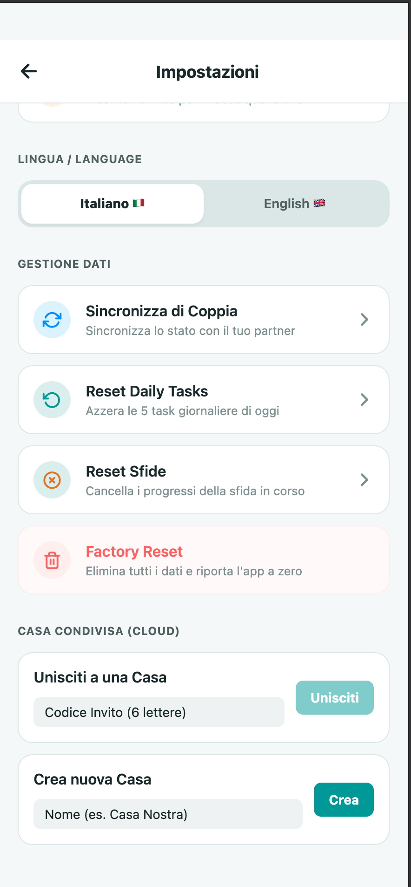

# Tzerachìa 🧹✨

Tzerachìa is a beautiful mobile application designed to simplify and organize daily and weekly household chores, as well as intensive cleaning challenges. Built with React Native and Expo, it offers a modern, smooth, and minimalist user experience in iOS style.

## Key Features

- **Daily Routine (Daily Tasks)**: 5 essential daily micro-tasks to keep the house consistently tidy (make the beds, check the floors, etc.).
- **Daily Focus**: Each day is assigned a specific area of the house (e.g., Mondays for bathrooms, Tuesdays for dusting) so you never have to do all the "heavy cleaning" at once.
- **15-Minute Session Timer**: A built-in timer for your "Focus" to help you concentrate without stress, featuring haptic feedback (vibration) upon completion.
- **Challenges**: 7- or 28-day challenges to get your home back in shape from scratch, trackable step-by-step.
- **DIY Guides & Recipes**: A catalog of recipes for making natural cleaners (e.g., vinegar and baking soda) and quick guides ("Speed Cleaning"). Users can also add their own custom guides and recipes!
- **Local Notifications**: Configurable daily reminders so you never forget your 15 minutes of focus.
- **Multilanguage Support**: Fully localized in both English and Italian, dynamically switchable from the settings.

## App Screenshots

Here is a preview of the user interface:

### Home & Daily Routine


### DIY Guides & Resources


### Weekly Schedule


### Cloud Sync & Settings


## Technologies Used

- **React Native** & **Expo**
- **TypeScript** for type safety
- **React Navigation** (Bottom Tabs & Native Stack)
- **Supabase** for PostgreSQL database, anonymous authentication, and realtime sync
- **AsyncStorage** for saving local data offline
- **Expo Notifications** for local reminders
- **i18n-js** for localization (IT/EN support)

## How to Run the Project

1. Make sure you have Node.js installed.
2. Run `npm install` or `yarn install`.
3. Start the development server with `npx expo start`.
4. Use the **Expo Go** app on your smartphone by scanning the QR Code, or launch an iOS/Android emulator. For Web usage, press `w` in the terminal.

## Backend Setup (Supabase)

This project relies on Supabase for real-time data synchronization between members of the same household. To configure your Supabase environment from scratch, follow these steps:

### 1. Prerequisites
- Create a project on [Supabase](https://supabase.com/).
- Go to the **Authentication** -> **Providers** section and enable **Anonymous Sign-ins**. This allows users to start using the app immediately without registering via email/password, while maintaining device synchronization.

### 2. Environment Variables
Create a `.env` file in the root of the project (at the same level as `package.json`) and insert your Supabase keys, which you can find in **Project Settings** -> **API**:

```env
EXPO_PUBLIC_SUPABASE_URL=https://your-project.supabase.co
EXPO_PUBLIC_SUPABASE_ANON_KEY=your-anon-key
```

### 3. Database Setup (SQL Script)
Go to the **SQL Editor** section in Supabase and create a new query. Paste and run the following SQL script to create the necessary tables, set up Row Level Security (RLS) policies, and enable real-time synchronization:

```sql
-- 1. Create Households table
CREATE TABLE public.households (
  id uuid DEFAULT gen_random_uuid() PRIMARY KEY,
  name text NOT NULL,
  invite_code text NOT NULL UNIQUE,
  created_at timestamp with time zone DEFAULT timezone('utc'::text, now()) NOT NULL
);

-- 2. Create Household Members table
CREATE TABLE public.household_members (
  id uuid DEFAULT gen_random_uuid() PRIMARY KEY,
  household_id uuid REFERENCES public.households(id) ON DELETE CASCADE,
  user_id uuid NOT NULL,
  joined_at timestamp with time zone DEFAULT timezone('utc'::text, now()) NOT NULL,
  UNIQUE(household_id, user_id)
);

-- 3. Create Task Completions table
CREATE TABLE public.task_completions (
  id uuid DEFAULT gen_random_uuid() PRIMARY KEY,
  household_id uuid REFERENCES public.households(id) ON DELETE CASCADE,
  task_id text NOT NULL,
  completed_at date NOT NULL,
  completed_by uuid NOT NULL,
  UNIQUE(household_id, task_id, completed_at)
);

-- 4. Create Custom Tasks table
CREATE TABLE public.custom_tasks (
  id uuid DEFAULT gen_random_uuid() PRIMARY KEY,
  household_id uuid REFERENCES public.households(id) ON DELETE CASCADE,
  title text NOT NULL,
  date date NOT NULL,
  completed boolean DEFAULT false,
  created_by uuid NOT NULL,
  created_at timestamp with time zone DEFAULT timezone('utc'::text, now()) NOT NULL
);

-- 5. Create Custom Guides table
CREATE TABLE public.custom_guides (
  id uuid DEFAULT gen_random_uuid() PRIMARY KEY,
  household_id uuid REFERENCES public.households(id) ON DELETE CASCADE,
  title text NOT NULL,
  category text,
  content text NOT NULL,
  created_by uuid NOT NULL,
  created_at timestamp with time zone DEFAULT timezone('utc'::text, now()) NOT NULL
);

-- 6. Create Custom Recipes table
CREATE TABLE public.custom_recipes (
  id uuid DEFAULT gen_random_uuid() PRIMARY KEY,
  household_id uuid REFERENCES public.households(id) ON DELETE CASCADE,
  title text NOT NULL,
  category text,
  ingredients jsonb DEFAULT '[]'::jsonb,
  steps jsonb DEFAULT '[]'::jsonb,
  created_by uuid NOT NULL,
  created_at timestamp with time zone DEFAULT timezone('utc'::text, now()) NOT NULL
);

-- 7. Enable Row Level Security (RLS)
ALTER TABLE public.households ENABLE ROW LEVEL SECURITY;
ALTER TABLE public.household_members ENABLE ROW LEVEL SECURITY;
ALTER TABLE public.task_completions ENABLE ROW LEVEL SECURITY;
ALTER TABLE public.custom_tasks ENABLE ROW LEVEL SECURITY;
ALTER TABLE public.custom_guides ENABLE ROW LEVEL SECURITY;
ALTER TABLE public.custom_recipes ENABLE ROW LEVEL SECURITY;

-- 8. Setup RLS Policies (Allow access to household members)
-- For simplicity, we allow all authenticated users (even anonymous) 
-- to select, insert, update, and delete for their household.
-- Note: In a strict production app, policies should verify `user_id` matches auth.uid().

CREATE POLICY "Enable all access for all users" ON public.households FOR ALL USING (true);
CREATE POLICY "Enable all access for all users" ON public.household_members FOR ALL USING (true);
CREATE POLICY "Enable all access for all users" ON public.task_completions FOR ALL USING (true);
CREATE POLICY "Enable all access for all users" ON public.custom_tasks FOR ALL USING (true);
CREATE POLICY "Enable all access for all users" ON public.custom_guides FOR ALL USING (true);
CREATE POLICY "Enable all access for all users" ON public.custom_recipes FOR ALL USING (true);

-- 9. Enable Realtime Sync
-- Supabase automatically creates a publication named supabase_realtime.
-- We must explicitly add our tables to this publication for Realtime to work.
ALTER PUBLICATION supabase_realtime ADD TABLE public.task_completions;
ALTER PUBLICATION supabase_realtime ADD TABLE public.custom_tasks;
ALTER PUBLICATION supabase_realtime ADD TABLE public.custom_guides;
ALTER PUBLICATION supabase_realtime ADD TABLE public.custom_recipes;
```

## Folder Structure

A quick overview of the project's organization to help you navigate the codebase:

```text
Tzerachìa/
├── assets/             # App icons, splash screens, and static images
├── src/
│   ├── components/     # Reusable UI components
│   ├── context/        # AppContext for global state orchestration
│   ├── data/           # Default recipes, guides, and challenges
│   ├── hooks/          # Custom hooks (e.g., useTasks, useHouseholdSync)
│   ├── i18n/           # Translations and localization (IT/EN)
│   ├── lib/            # External library configurations (e.g., Supabase)
│   ├── screens/        # Main application screens (Home, Settings, etc.)
│   ├── services/       # Services for storage and notifications
│   ├── types/          # TypeScript definitions
│   └── utils/          # Helper functions and utilities
├── App.tsx             # Main application entry point
├── app.json            # Expo configuration
└── package.json        # Dependencies and scripts
```

## Build & Deploy

This project is configured to use **EAS Build** (Expo Application Services) for generating standalone binaries.

1. Install the EAS CLI: `npm install -g eas-cli`
2. Log in to your Expo account: `eas login`
3. Build for Android: `eas build -p android --profile preview`
4. Build for iOS: `eas build -p ios`

## Contributing

Contributions are welcome! If you have a feature request, bug report, or a suggestion, please open an issue or submit a pull request. 
When contributing, please ensure your code follows the existing style and passes TypeScript checks (`npx tsc --noEmit`).

## License

This project is open-source and available under the [MIT License](LICENSE).

---

## ℹ️ Disclaimer & Credits
This application is an independent, non-official personal project developed for home organization and household task management. All original code, UI design, and features are open-source. Any inspiration drawn from popular home cleaning methodologies is used abstractly, and all trademarks belong to their respective owners.

